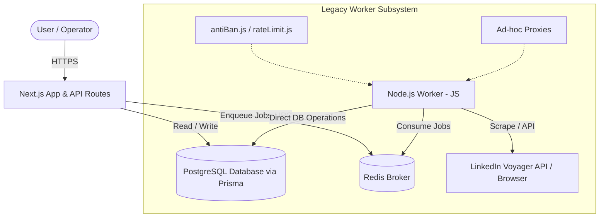
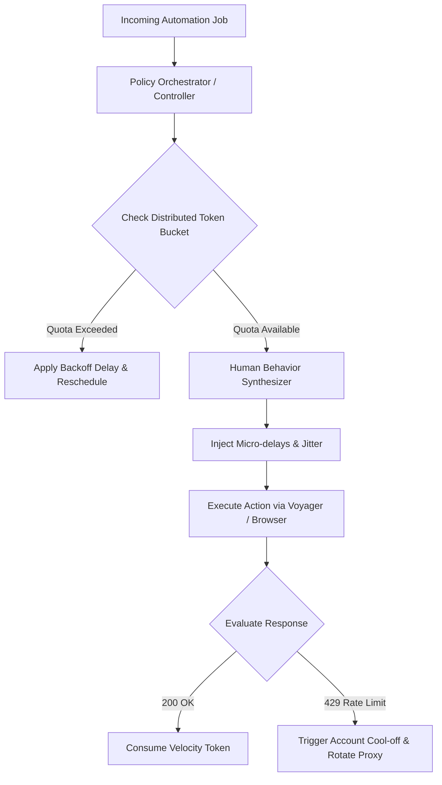
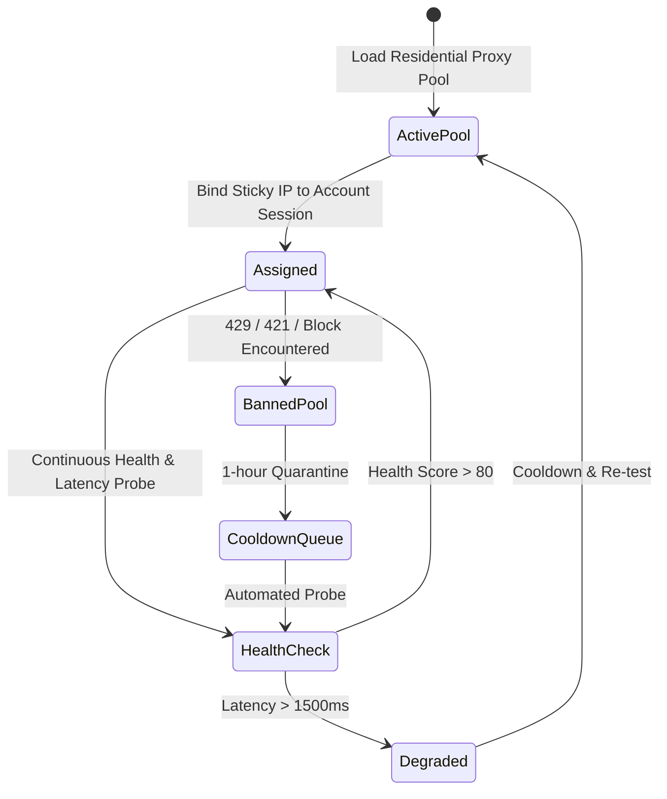
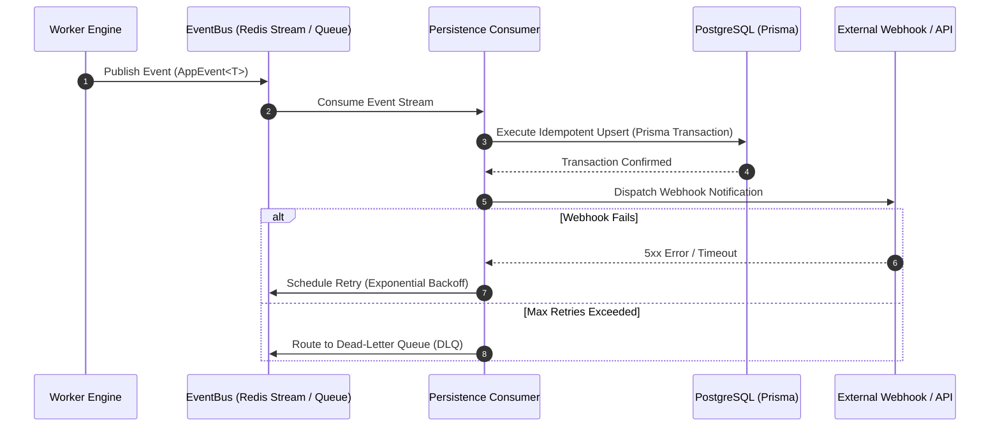
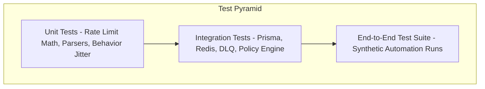
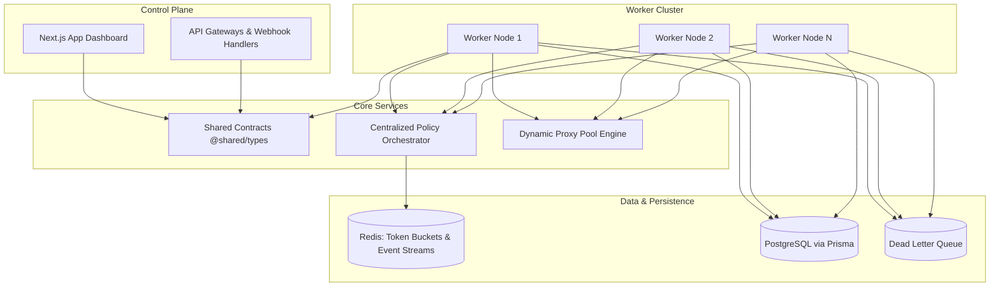
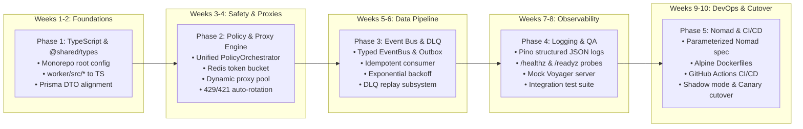

# LinkedIn Hyper-V Modernization & Architecture Blueprint

---

## 1. Executive Summary

The **LinkedIn Hyper-V** platform is an enterprise-grade, high-scale LinkedIn data synchronization, messaging, and automation platform operating on a dual-engine architecture: a Next.js web application and a Node.js background worker. Over successive feature additions, the platform has encountered architectural drift, language asymmetry, fragmented deployment scripts, and non-standardized state management.

This document establishes the definitive modernization blueprint to transition the platform into an enterprise-grade, resilient, and fully type-safe microservice architecture. Key pillars include:
- **100% End-to-End Type Safety** via TypeScript unification and a shared contract layer.
- **Account Longevity & Anti-Ban Hardening** via a centralized policy orchestrator and dynamic proxy pool engine.
- **Idempotent, Resilient Event Data Pipeline** featuring exponential backoff retries, dead-letter queues (DLQs), and transactional database guarantees.
- **Single-Source DevOps & Infrastructure** consolidating dual Nomad configurations and deployment scripts into a streamlined CI/CD workflow.

---

## 2. Introduction

### Purpose
This blueprint defines the target architecture, component specifications, migration roadmap, and operational guidelines required to refactor and modernize the LinkedIn Hyper-V repository.

### Target Audience
- **Full-Stack & Backend Engineers:** Implementation guidance for TypeScript conversion, shared contracts, and worker modules.
- **DevOps & Platform Engineers:** Blueprint for Nomad job consolidation, Docker optimization, and CI/CD pipelines.
- **QA & Reliability Engineers:** Test strategy, observability standards, and data integrity verification.

---

## 3. Project Overview

- **Repository:** `Acumen-org/Linkedin-Hyper-V`
- **Core Technology Stack:** Next.js (Dashboard), Node.js/TypeScript (Worker Engine), Prisma ORM, Redis (IPC/Cache), PostgreSQL (Persistence), Docker, HashiCorp Nomad.
- **Primary Capabilities:** High-scale LinkedIn contact synchronization, messaging automation, connection requests, Voyager API emulation, and human behavior synthesis.

---

## 4. Repository Structure

The target repository structure transitions to a clean, modular monorepo/workspace format:

```text
Linkedin-Hyper-V/
├── .github/
│   └── workflows/
│       ├── ci.yml                     # Unified CI pipeline (lint, typecheck, test, build)
│       └── cd.yml                     # Automated deployment pipeline
├── app/                               # Next.js Dashboard & Control Plane (TypeScript)
│   ├── src/
│   │   ├── components/                # React UI components
│   │   ├── pages/ (or app/)           # Next.js route handlers & UI views
│   │   ├── services/                  # Application services
│   │   └── lib/                       # Utility libraries
│   ├── tsconfig.json
│   └── package.json
├── worker/                            # Background Worker & Automation Engine (TypeScript)
│   ├── src/
│   │   ├── automation/                # Browser automation & Voyager client
│   │   ├── policy/                    # Centralized Anti-Ban & Velocity controller
│   │   ├── proxy/                     # Dynamic proxy pool manager
│   │   ├── events/                    # Event bus, consumers & DLQ handlers
│   │   └── index.ts                   # Worker entrypoint
│   ├── tsconfig.json
│   └── package.json
├── packages/
│   └── shared/                        # @shared/types & Contracts
│       ├── src/
│       │   ├── models/                # Domain entity definitions
│       │   ├── events/                # Event payload interfaces
│       │   ├── api/                   # Request/Response DTOs
│       │   └── index.ts
│       ├── tsconfig.json
│       └── package.json
├── prisma/
│   ├── schema.prisma                  # Centralized database schema
│   └── migrations/                    # Database migration history
├── deployment/
│   ├── nomad/
│   │   └── linkedin-console.nomad.hcl # Single, parameterized Nomad job template
│   ├── docker/
│   │   ├── Dockerfile.app             # Optimized multi-stage Dockerfile for Next.js
│   │   └── Dockerfile.worker          # Optimized multi-stage Dockerfile for Worker
│   └── env/
│       └── .env.example               # Standardized environment blueprint
├── package.json                       # Workspace root package.json
└── tsconfig.base.json                 # Base TypeScript configuration
```

---

## 5. Existing Architecture

The existing deployment consists of two decoupled components communicating over Redis and direct database connections:



---

## 6. Current Architecture Problems

The existing system exhibits several critical architectural, operational, and structural bottlenecks that threaten system stability, developer velocity, and account longevity.

### 6.0 Architectural Failure-Mode Diagram

```mermaid
flowchart TD
    subgraph Frontend_Plane [1. Frontend Control Plane (TypeScript)]
        NextApp[Next.js Dashboard & API] -->|Emits untyped / dynamic IPC payload| RedisQueue[(Redis Queue / IPC)]
    end

    subgraph Worker_Failure [2. Language Asymmetry & Type Drift]
        RedisQueue -->|Unvalidated raw payload| WorkerJS[Legacy Node.js Worker (JavaScript)]
        WorkerJS -.->|Silent Runtime TypeError / Schema Drift| Crash[Worker Task Crash]
    end

    subgraph AntiBan_Collision [3. Anti-Ban Race Conditions & Velocity Breaches]
        W1[Worker Instance 1] -->|Reads local in-memory counter| LocalMem1[(Local Memory Counter)]
        W2[Worker Instance 2] -->|Reads local in-memory counter| LocalMem2[(Local Memory Counter)]
        W1 -->|Simultaneous Request for Account X| LinkedInAPI[LinkedIn Voyager API]
        W2 -->|Simultaneous Request for Account X| LinkedInAPI
        LinkedInAPI -->|Hourly / Daily Velocity Limit Breached| BanEvent[Account Ban / Checkpoint / 429 Throttle]
    end

    subgraph Proxy_Cascade [4. Fragile Static Proxy Pool]
        WorkerJS -->|Uses unmonitored proxy IP| StaleProxy[Stale / Degraded Proxy IP]
        StaleProxy -->|HTTP 429 / 421 / Connection Timeout| TaskDrop[Job Drop - No Automated Rotation]
    end

    subgraph Pipeline_Loss [5. Non-Idempotent Data Pipeline & Silent Loss]
        WorkerJS -->|Non-idempotent insert| PostgresDB[(PostgreSQL via Prisma)]
        PostgresDB -->|Unsafe duplicate row insertion| DataCorruption[Duplicate Messages / Inconsistent State]
        WorkerJS -->|Direct Webhook Dispatch| ExtWebhook[External Webhook Consumer]
        ExtWebhook -.->|Network 5xx Error / Timeout| SilentLoss[Message Dropped - No DLQ / No Backoff Retry]
    end

    subgraph Deployment_Drift [6. DevOps & Infrastructure Fragmentation]
        NomadStd[linkedin-console.nomad.hcl] <-->|Configuration Divergence| NomadSec[linkedin-console.secure.nomad.hcl]
        NomadStd -.->|Divergent environment variables| StagingProdDiff[Staging vs Production Divergence]
    end
```

---

### 6.1. Worker-to-Frontend Language Asymmetry & Schema Drift
- **Root Problem:** While the Next.js frontend (`app/`) is written in TypeScript with type definitions, the background automation worker (`worker/src/*`) is composed of dynamic, un-typed JavaScript files.
- **Architectural Impact:** 
  - **Runtime Dynamic Failures:** Undefined property accesses (e.g., `TypeError: Cannot read properties of undefined (reading 'voyagerProfile')`) occur in worker tasks at runtime rather than being caught at build time.
  - **Schema Divergence:** When Prisma schema models or API routes change in the frontend, worker modules remain uninformed, causing silent field mismatches, corrupted data saves, and deserialization failures in Redis queues.
  - **Unvalidated API Envelopes:** Responses from the LinkedIn Voyager API are parsed without strict type guards or validation schemas, making the worker highly vulnerable to LinkedIn upstream schema modifications.

#### Legacy Anti-Pattern Example (Worker Data Processing)
```javascript
// worker/src/sync/messageSync.js (Legacy JS - No Type Safety)
async function processIncomingMessage(rawPayload) {
  // Silent runtime bug if payload structure changes or is undefined
  const senderId = rawPayload.elements[0].actor.id; 
  const text = rawPayload.elements[0].body.text;
  
  // Direct DB call with unvalidated types
  await db.message.create({
    data: { senderId, text, timestamp: new Date(rawPayload.createdAt) }
  });
}
```

---

### 6.2. Decentralized Anti-Ban & Rate-Limiting Logic
- **Root Problem:** Rate limiting, delay synthesis, and anti-ban checks are split across multiple disparate files: `antiBan.js`, `rateLimit.js`, and `humanBehavior.js`.
- **Architectural Impact:**
  - **Concurrent Worker Collisions:** When multiple worker nodes or background threads execute jobs concurrently for the same LinkedIn account, each worker evaluates its own local rate limit without global coordination. This results in burst traffic exceeding LinkedIn's hourly/daily thresholds.
  - **Account Restriction Risk:** Breaching velocity limits triggers LinkedIn security checkpoints (CAPTCHA challenges, SMS/email verification, or permanent account restriction).
  - **Unsynchronized Jitter:** Delays are generated locally with naive `setTimeout` calls without true Gaussian entropy or behavioral scheduling.

#### Legacy Anti-Pattern Example (Decentralized Rate Limiting)
```javascript
// worker/src/antiBan.js vs worker/src/rateLimit.js (Independent state)
let localActionCount = 0; // Stored in-memory on individual worker instance!

function canPerformAction() {
  // Fails under multi-instance scaling: Node 1 and Node 2 both see count < 20
  if (localActionCount < 20) {
    localActionCount++;
    return true;
  }
  return false;
}
```

---

### 6.3. Fragile Proxy Management & Error Cascades
- **Root Problem:** Proxy credentials and endpoints are handled statically or passed via naive connection strings without lifecycle management.
- **Architectural Impact:**
  - **No Active Health Checking:** If a proxy becomes stale, slow (high latency > 3000ms), or blocked by LinkedIn, the worker continues to dispatch requests through it until tasks time out.
  - **No Auto-Rotation on Rate Limit (429/421):** When LinkedIn responds with HTTP `429 Too Many Requests` or `421 Misdirected Request`, the worker fails the job entirely rather than seamlessly rotating to a fresh residential IP.
  - **Absence of Sticky Residential Binding:** Proxies hop arbitrarily between requests, causing LinkedIn anti-fraud algorithms to detect rapid geographic IP hopping on a single logged-in session.

---

### 6.4. Data Pipeline Non-Idempotency & Lack of Resilience
- **Root Problem:** Inter-process communication and state ingestion via `eventBus.js` and `persistenceConsumer.js` lack transactional outbox patterns, deterministic idempotency keys, and automated dead-letter queues.
- **Architectural Impact:**
  - **Message Duplication:** Retrying failed sync operations produces duplicate conversation and message records in PostgreSQL, requiring manual execution of `/api/maintenance/messages/dedupe`.
  - **Silent Message Loss:** If a webhook consumer or database transaction fails during high load, events are dropped without a persistent Dead-Letter Queue (DLQ) for inspection and replay.
  - **Lack of Backoff Strategies:** Immediate retries exacerbate database contention and trigger upstream rate-limiting cascades.

---

### 6.5. Deployment Fragmentation & Infrastructure Drift
- **Root Problem:** The repository maintains multiple conflicting deployment artifacts in `deployment/`:
  - `deployment/*.sh` containing non-deterministic bash deployment commands.
  - Dual Nomad files: `linkedin-console.nomad.hcl` (standard) and `linkedin-console.secure.nomad.hcl` (secured variants).
- **Architectural Impact:**
  - **Operational Drift:** Fixes applied to `linkedin-console.secure.nomad.hcl` are frequently missed in `linkedin-console.nomad.hcl`, leading to divergent behavior between staging and production environments.
  - **Security Misconfigurations:** Lack of a single environment variable blueprint (`.env.example`) leads to leaked secrets or missing configuration parameters across environments.

---

### 6.6. Observability, Logging, and Testing Deficits
- **Root Problem:** Observability relies on unstructured `console.log` statements without unified log levels, correlation IDs, or health check endpoints.
- **Architectural Impact:**
  - **Blind Debugging:** In distributed worker deployments, it is impossible to trace a single transaction or job execution across frontend, Redis, and worker instances without a shared `traceId`.
  - **Test Suite Blindspots:** Existing tests rely on superficial unit mocks and lack integration tests for anti-ban triggers, proxy failover mechanisms, and database deduplication routines.

---

### 6.7. Root Cause Analysis (RCA) & Impact Matrix

| Domain | Root Cause | Severity | Operational & Business Impact |
| :--- | :--- | :--- | :--- |
| **Worker Engine** | Dynamic JavaScript with no compile-time typing | **CRITICAL** | Production crashes, runtime `TypeError` exceptions, high maintenance overhead |
| **Account Safety** | In-memory, non-distributed rate limit counters | **CRITICAL** | Account bans, loss of client LinkedIn accounts, reputational damage |
| **Proxy Pool** | Static proxy list without health/rotation logic | **HIGH** | High job failure rates, IP blocklisting, proxy billing waste |
| **Event Bus** | Missing DLQ and non-idempotent consumers | **HIGH** | Data inconsistency, duplicate messages, dropped webhook notifications |
| **Deployment** | Dual Nomad specs and fragmented shell scripts | **MEDIUM** | Inconsistent environments, deployment failures, high DevOps toil |
| **Monitoring** | Unstructured console logging, no health endpoints | **MEDIUM** | Long Mean Time to Detection (MTTD) and Resolution (MTTR) for outages |

---

## 7. Before vs After Comparison

| Dimension | Legacy State (Before) | Modernized State (After) |
| :--- | :--- | :--- |
| **Language Stack** | Frontend in TypeScript, Worker in JavaScript | **100% Unified TypeScript** across all packages |
| **Data Contracts** | Disparate, manual type synchronization | **`@shared/types`** contract layer for models, DTOs, and events |
| **Anti-Ban Enforcement** | Fragmented scripts (`antiBan.js`, `rateLimit.js`) | **Centralized Policy Orchestrator** with distributed token buckets |
| **Proxy Handling** | Static/manual proxy strings | **Dynamic Proxy Pool** with auto-rotation, health scoring, & sticky IPs |
| **Event Pipeline** | Unbuffered, direct persistence | **Idempotent, database-first event bus** with transactional outbox |
| **Failure Recovery** | Dropped messages on network/DB failure | **Exponential backoff with jitter** & **Dead-Letter Queue (DLQ)** |
| **Nomad Infrastructure**| Dual files (`*.nomad.hcl` & `*.secure.nomad.hcl`) | **Single parameterized Nomad job specification** |
| **CI/CD** | Ad-hoc manual scripts (`deployment/*.sh`) | **Automated GitHub Actions CI/CD** (Lint, Typecheck, Test, Build) |
| **Observability** | `console.log` statements | **Structured JSON logging (Pino)** with distributed `traceId` correlation |
| **Test Coverage** | Isolated basic mocks | **Full integration test suite** (Anti-ban, deduplication, DLQ routing) |

---

## 8. Modernization Objectives

1. **100% End-to-End Type Safety:** Ensure strict compilation (`tsc --noEmit`) across the entire repository.
2. **Account Safety Guarantee:** Enforce global account action velocity quotas to eliminate anti-ban triggers.
3. **Resilient Data Pipeline:** Guarantee zero message loss and complete idempotency across synchronization jobs.
4. **Unified Cloud-Native Delivery:** Standardize containerization and deployment onto a single parameterized Nomad pipeline.

---

## 9. TypeScript Migration

All worker modules under `worker/src/*` will be upgraded from JavaScript to strict TypeScript.

### Strict Compiler Configuration (`tsconfig.base.json`)
```json
{
  "compilerOptions": {
    "target": "ES2022",
    "module": "NodeNext",
    "moduleResolution": "NodeNext",
    "lib": ["ES2022"],
    "strict": true,
    "noImplicitAny": true,
    "strictNullChecks": true,
    "exactOptionalPropertyTypes": true,
    "noUncheckedIndexedAccess": true,
    "declaration": true,
    "sourceMap": true,
    "outDir": "./dist",
    "baseUrl": ".",
    "paths": {
      "@shared/*": ["./packages/shared/src/*"]
    }
  }
}
```

### Module Migration Plan
- `worker/src/voyager/` &rarr; Strongly typed LinkedIn Voyager HTTP client and response structures.
- `worker/src/automation/` &rarr; Typed browser orchestration with structured input/output envelopes.
- `worker/src/state/` &rarr; Strict state machines tracking job and session lifecycles.

---

## 10. Shared Contract Layer (`@shared/types`)

Extract shared data structures into an internal workspace package `@shared/types`:

```typescript
// packages/shared/src/models/account.ts
export interface LinkedInAccount {
  id: string;
  email: string;
  proxySessionId?: string;
  status: 'ACTIVE' | 'WARMING' | 'RESTRICTED' | 'RATE_LIMITED' | 'DISABLED';
  hourlyActionLimit: number;
  dailyActionLimit: number;
  createdAt: Date;
  updatedAt: Date;
}

// packages/shared/src/events/ipc.ts
export type EventPayloadMap = {
  'MESSAGES_SYNC_REQUESTED': { accountId: string; since: string };
  'MESSAGE_RECEIVED': { accountId: string; conversationId: string; messageId: string; content: string };
  'RATE_LIMIT_TRIGGERED': { accountId: string; endpoint: string; retryAfterMs: number; proxyIp: string };
};

export interface AppEvent<K extends keyof EventPayloadMap> {
  eventId: string;
  traceId: string;
  eventName: K;
  timestamp: number;
  payload: EventPayloadMap[K];
}
```

---

## 11. Policy & Account Safety Architecture

Consolidate `antiBan.js`, `rateLimit.js`, and `humanBehavior.js` into a cohesive **Policy Orchestrator**.



### Key Policy Components
- **Distributed Token Bucket:** Uses Redis to enforce global rate limits across all distributed worker nodes per LinkedIn account.
- **Human Behavior Synthesizer:** Applies Gaussian distribution delays, realistic mouse/keystroke vectors, and browsing micro-pauses.
- **Account Warm-up Schedules:** Automatically caps daily connection and messaging quotas for newly connected accounts.

---

## 12. Dynamic Proxy Pool Management

Upgrade proxy handling to a resilient, self-healing proxy subsystem:



- **Health Checks:** Proactive HTTP latency and connection checks to validation endpoints.
- **Auto-Rotation on Error:** Immediate proxy rotation upon receiving HTTP 421/429 status codes.
- **Sticky Residential Binding:** Ensures a specific LinkedIn account always routes through the same geolocation and residential IP during an active session.

---

## 13. Event-Driven Data Pipeline

Establish an event pipeline between the worker engine, Prisma ORM, and external consumers (webhooks/API integrations):



---

## 14. Idempotency Strategy

To prevent data duplication during network retries or parallel worker runs:
- **Natural & Deterministic Keys:** Generate composite idempotency keys (e.g., `hash(accountId + conversationId + remoteMessageId)`).
- **Prisma Upsert Guarantees:** Enforce strict unique constraints across message and contact tables.
- **Deduplication Maintenance:** Standardize maintenance routes (e.g., `/api/maintenance/messages/dedupe`) to run background deduplication passes with transactional safety.

---

## 15. Retry & Dead Letter Queue (DLQ)

Fortify `eventBus.ts` and `persistenceConsumer.ts` with resilience mechanisms:

```typescript
// Pseudo-code for Exponential Backoff with Jitter
function calculateBackoff(retryCount: number, baseMs = 1000, maxMs = 60000): number {
  const exponential = Math.min(maxMs, baseMs * Math.pow(2, retryCount));
  const jitter = exponential * 0.2 * Math.random(); // 20% jitter
  return exponential + jitter;
}
```

- **Max Retries:** 5 attempts with exponential backoff and jitter.
- **DLQ Routing:** Exhausted retries are placed in a persistent DLQ table/stream containing error stack traces, execution context, and original payload.
- **DLQ Management Interface:** Admin endpoints to inspect, replay, or discard failed events.

---

## 16. Logging & Observability

Standardize all logging via **Pino** structured JSON logging:

```json
{
  "level": "info",
  "time": 1771948800000,
  "pid": 1042,
  "hostname": "worker-prod-01",
  "traceId": "c4b3a2-9f12-4a7b",
  "accountId": "acc_linkedin_891",
  "component": "PolicyOrchestrator",
  "msg": "Rate limit quota check passed: 14/50 actions used in current window"
}
```

### Health Check Endpoints
- `/healthz`: Liveness probe verifying process responsiveness.
- `/readyz`: Readiness probe verifying PostgreSQL, Redis, and proxy pool connectivity.
- `/metrics`: System metrics (action velocity, queue depth, DLQ size).

---

## 17. Security Improvements

- **Secrets Isolation:** Remove hardcoded credentials; inject secrets via HashiCorp Vault / Nomad environment secrets.
- **PII & Credential Redaction:** Automatic scrubbing of passwords, session cookies (li_at), and tokens from application logs.
- **TLS & Proxy Security:** Enforce TLS 1.3 across internal IPC channels and secure proxy tunnels.

---

## 18. Testing Strategy



- **Unit Tests (Vitest/Jest):** Rate limiting token bucket calculations, proxy health scoring, parser functions.
- **Integration Tests:** Anti-ban rate limit thresholds, proxy rotation triggers, message deduplication endpoints (`/api/maintenance/messages/dedupe`), DLQ failover.
- **Mock Voyager Engine:** Local mock server simulating LinkedIn Voyager API responses (200, 421, 429, 999 anti-bot challenge).

---

## 19. Docker & Containerization

Multi-stage, minimal Docker images optimize build caching and security:

```dockerfile
# deployment/docker/Dockerfile.worker
FROM node:20-alpine AS base
WORKDIR /app
RUN apk add --no-cache libc6-compat

FROM base AS dependencies
COPY package.json package-lock.json ./
COPY packages/shared/package.json ./packages/shared/
COPY worker/package.json ./worker/
RUN npm ci

FROM base AS builder
COPY --from=dependencies /app/node_modules ./node_modules
COPY . .
RUN npm run build --workspace=@shared/types
RUN npm run build --workspace=worker

FROM base AS runner
ENV NODE_ENV=production
RUN addgroup --system --gid 1001 nodejs && adduser --system --uid 1001 workeruser
USER workeruser
COPY --from=builder /app/packages/shared/dist ./packages/shared/dist
COPY --from=builder /app/worker/dist ./worker/dist
COPY --from=builder /app/node_modules ./node_modules
COPY --from=builder /app/package.json ./package.json

CMD ["node", "worker/dist/index.js"]
```

---

## 20. Nomad Deployment Consolidation

Consolidate `linkedin-console.nomad.hcl` and `linkedin-console.secure.nomad.hcl` into a single parameterized job file.

```hcl
job "linkedin-hyper-v" {
  datacenters = ["dc1"]
  type        = "service"

  variable "environment" {
    type        = string
    description = "Deployment target environment (staging, production)"
  }

  variable "worker_count" {
    type        = number
    default     = 3
  }

  group "worker" {
    count = var.worker_count

    network {
      port "health" {
        to = 8080
      }
    }

    task "worker-service" {
      driver = "docker"

      config {
        image = "registry.internal.net/linkedin-worker:${var.environment}"
        ports = ["health"]
      }

      template {
        data = <<EOH
DATABASE_URL="{{ key "linkedin-hyper-v/${var.environment}/database_url" }}"
REDIS_URL="{{ key "linkedin-hyper-v/${var.environment}/redis_url" }}"
LOG_LEVEL="{{ keyOrDefault "linkedin-hyper-v/${var.environment}/log_level" "info" }}"
EOH
        destination = "secrets/file.env"
        env         = true
      }

      resources {
        cpu    = 1000
        memory = 1024
      }
    }
  }
}
```

---

## 21. CI/CD Pipeline (`.github/workflows/ci.yml`)

```yaml
name: CI/CD Pipeline

on:
  push:
    branches: [main, develop]
  pull_request:
    branches: [main]

jobs:
  validate:
    name: Lint, Typecheck & Test
    runs-on: ubuntu-latest
    steps:
      - uses: actions/checkout@v4
      - uses: actions/setup-node@v4
        with:
          node-version: 20
          cache: 'npm'
      - name: Install Dependencies
        run: npm ci
      - name: TypeScript Validation (tsc --noEmit)
        run: npm run typecheck
      - name: Run Test Suite
        run: npm test
      - name: Validate Prisma Schema
        run: npx prisma validate

  build-and-deploy:
    needs: validate
    if: github.ref == 'refs/heads/main'
    runs-on: ubuntu-latest
    steps:
      - uses: actions/checkout@v4
      - name: Build Docker Images
        run: |
          docker build -f deployment/docker/Dockerfile.app -t registry.internal.net/linkedin-app:latest .
          docker build -f deployment/docker/Dockerfile.worker -t registry.internal.net/linkedin-worker:latest .
      - name: Deploy to Nomad
        run: |
          nomad job run -var="environment=production" deployment/nomad/linkedin-console.nomad.hcl
```

---

## 22. Configuration & Secrets Management

- **Blueprints:** Central `.env.example` defining all required configuration variables.
- **Dynamic Vault Injection:** Integration with HashiCorp Vault via Nomad templates for credential rotation.
- **Validation:** Runtime environment schema validation using Zod on service bootup.

---

## 23. Proposed Architecture



---

## 24. Implementation Roadmap

The modernization initiative will be executed in a structured, five-phase rollout over a 10-week schedule to ensure zero downtime, prevent account disruption, and deliver continuous value.

### 24.1 Modernization Timeline & Milestone Roadmap



| Phase | Timeline | Primary Objective | Key Deliverable |
| :--- | :--- | :--- | :--- |
| **Phase 1** | Weeks 1–2 | TypeScript Migration & Shared Contracts | Clean `tsc --noEmit` build & `@shared/types` |
| **Phase 2** | Weeks 3–4 | Policy Orchestrator & Dynamic Proxy Pool | Anti-ban protection & auto-rotating proxy pool |
| **Phase 3** | Weeks 5–6 | Event Pipeline, Idempotency & DLQ | Resilient event bus & Dead-Letter Queue |
| **Phase 4** | Weeks 7–8 | Structured Logging & Integration Tests | Pino logging middleware & test suite (>85% coverage) |
| **Phase 5** | Weeks 9–10 | Nomad Consolidation & CI/CD Deployment | Single Nomad template & automated GitHub Actions |

### 24.2 Phased Dependency & Milestone Execution Flow

```mermaid
flowchart TD
    subgraph P1 ["Phase 1: Foundations & Contracts (Weeks 1-2)"]
        A1["WP 1.1: Workspace Setup"] --> A2["WP 1.2: @shared/types Package"]
        A2 --> A3["WP 1.3: Worker TS Migration (worker/src/*)"]
        A3 --> A4["WP 1.4: Prisma Schema & DTO Alignment"]
        A4 --> M1{{"Milestone 1: 100% Type-Check Clean"}}
    end

    subgraph P2 ["Phase 2: Policy & Resilience Engine (Weeks 3-4)"]
        M1 --> B1["WP 2.1: PolicyOrchestrator.ts"]
        B1 --> B2["WP 2.2: Redis Token Bucket"]
        B2 --> B3["WP 2.3: Dynamic Proxy Pool Engine"]
        B3 --> B4["WP 2.4: Auto-Rotation on 429/421"]
        B4 --> M2{{"Milestone 2: Anti-Ban & Proxy Resilience Tested"}}
    end

    subgraph P3 ["Phase 3: Resilient Event Data Pipeline (Weeks 5-6)"]
        M2 --> C1["WP 3.1: Typed EventBus & Outbox"]
        C1 --> C2["WP 3.2: Idempotent Persistence Consumer"]
        C2 --> C3["WP 3.3: Exponential Backoff & DLQ"]
        C3 --> C4["WP 3.4: Deduplication Maintenance Hardening"]
        C4 --> M3{{"Milestone 3: Zero-Data-Loss Pipeline Validated"}}
    end

    subgraph P4 ["Phase 4: Observability & Integration QA (Weeks 7-8)"]
        M3 --> D1["WP 4.1: Pino Structured JSON Logging"]
        D1 --> D2["WP 4.2: Health Probes (/healthz, /readyz)"]
        D2 --> D3["WP 4.3: Credential Sanitization"]
        D3 --> D4["WP 4.4: Voyager Mock & Integration Tests"]
        D4 --> M4{{"Milestone 4: >85% Test Coverage & Observability"}}
    end

    subgraph P5 ["Phase 5: DevOps, Nomad & Cutover (Weeks 9-10)"]
        M4 --> E1["WP 5.1: Multi-Stage Alpine Dockerfiles"]
        E1 --> E2["WP 5.2: Parameterized Nomad Job Template"]
        E2 --> E3["WP 5.3: Script Cleanup & Env Blueprints"]
        E3 --> E4["WP 5.4: Automated CI/CD (.github/ci.yml)"]
        E4 --> E5["WP 5.5: Shadow Mode & Canary Cutover"]
        E5 --> M5{{"Milestone 5: Production Modernization Complete"}}
    end
```



---

### Phase 1: Shared Contract Layer & TypeScript Migration (Weeks 1–2)
- **Primary Goal:** Eliminate language asymmetry and establish end-to-end compile-time type safety.
- **Work Packages:**
  - **WP 1.1: Monorepo Workspace Configuration:** Establish npm/pnpm workspace layout with root `package.json` and strict `tsconfig.base.json`.
  - **WP 1.2: `@shared/types` Extraction:** Create shared contracts package defining account models, message envelopes, API DTOs, and event signatures.
  - **WP 1.3: Worker TypeScript Conversion:** Migrate all files in `worker/src/*` from JavaScript (`.js`) to TypeScript (`.ts`), eliminating dynamic `any` usages and adding strict return types.
  - **WP 1.4: Prisma Schema & DTO Alignment:** Synchronize Prisma client types across `app/` and `worker/`, ensuring database-level type parity.
- **Key Deliverables:** 
  - `@shared/types` package linked across workspace.
  - Full project compilation passing `tsc --noEmit` with zero errors.
- **Exit Criteria:** Clean build across frontend and worker; zero dynamic runtime errors in test environment.

---

### Phase 2: Account Safety, Policy Orchestrator & Proxy Engine (Weeks 3–4)
- **Primary Goal:** Consolidate fragmented anti-ban scripts and deploy self-healing proxy pool infrastructure.
- **Work Packages:**
  - **WP 2.1: Centralized Policy Orchestrator:** Refactor `antiBan.js`, `rateLimit.js`, and `humanBehavior.js` into a unified `PolicyOrchestrator.ts` module.
  - **WP 2.2: Distributed Token Bucket:** Deploy Redis-backed rate limiters tracking global account velocity across distributed worker instances.
  - **WP 2.3: Dynamic Proxy Pool Manager:** Implement `DynamicProxyPool.ts` with automated TCP/HTTP health checks, latency scoring, and sticky residential session binding.
  - **WP 2.4: Auto-Rotation & Circuit Breaking:** Implement automated fallback and proxy quarantine upon receiving HTTP 429, 421, or 999 response codes.
- **Key Deliverables:**
  - `PolicyOrchestrator.ts` and `DynamicProxyPool.ts` integrated into worker lifecycle.
  - Redis token bucket scripts (`rate_limit.lua`).
- **Exit Criteria:** Multi-worker simulation confirms zero rate limit breaches when running 10+ concurrent worker nodes against single accounts.

---

### Phase 3: Resilient Event Pipeline, Idempotency & DLQ (Weeks 5–6)
- **Primary Goal:** Establish zero-data-loss event streaming, transactional database operations, and dead-letter queues.
- **Work Packages:**
  - **WP 3.1: Typed EventBus & Outbox Pattern:** Upgrade `eventBus.ts` to enforce typed event envelopes and correlation IDs (`traceId`).
  - **WP 3.2: Idempotent Persistence Consumer:** Refactor `persistenceConsumer.ts` with deterministic idempotency keys (`accountId:conversationId:messageId`) and Prisma transactional upserts.
  - **WP 3.3: Exponential Backoff & DLQ Subsystem:** Implement retry queues with truncated exponential backoff and jitter; route exhausted retries to a persistent Dead-Letter Queue.
  - **WP 3.4: Message Deduplication Hardening:** Upgrade `/api/maintenance/messages/dedupe` to execute atomic deduplication jobs without locking production tables.
- **Key Deliverables:**
  - Fault-tolerant `EventBus` and `PersistenceConsumer` modules.
  - DLQ inspection and replay administrative API routes.
- **Exit Criteria:** Simulated network/DB failure tests verify 100% message recovery without duplicates or dropped events.

---

### Phase 4: Observability, Security & Integration Testing (Weeks 7–8)
- **Primary Goal:** Provide structured visibility, harden security boundaries, and validate real-world scenarios.
- **Work Packages:**
  - **WP 4.1: Structured JSON Logging:** Replace `console.log` with Pino logging across all services, injecting `traceId`, `jobId`, and `accountId` into every log line.
  - **WP 4.2: Centralized Health Probes:** Implement `/healthz` (liveness), `/readyz` (readiness), and `/metrics` (queue depths, velocity stats) endpoints.
  - **WP 4.3: Security & Credential Scrubbing:** Implement automated log sanitization for sensitive tokens (`li_at`, passwords, webhook secrets).
  - **WP 4.4: Integration Test Suite & Voyager Mock:** Construct comprehensive integration tests using a simulated LinkedIn Voyager backend to test edge cases, rate limits, and network partitions.
- **Key Deliverables:**
  - Standardized Pino logging middleware and health check router.
  - Comprehensive integration test suite passing in CI.
- **Exit Criteria:** Test suite achieves >85% branch coverage on policy, proxy, and event pipeline modules.

---

### Phase 5: Infrastructure Consolidation & CI/CD Automation (Weeks 9–10)
- **Primary Goal:** Standardize Docker builds, unify Nomad deployment specs, and automate deployment pipelines.
- **Work Packages:**
  - **WP 5.1: Multi-Stage Dockerfiles:** Create lightweight, secure, non-root Docker images for `app` and `worker` based on Alpine Linux.
  - **WP 5.2: Nomad Job Consolidation:** Merge `linkedin-console.nomad.hcl` and `linkedin-console.secure.nomad.hcl` into a single parameterized Nomad job template using HCL variables.
  - **WP 5.3: Legacy Script Cleanup:** Remove fragmented `deployment/*.sh` scripts; replace with standard container entrypoints and environment blueprints (`.env.example`).
  - **WP 5.4: Automated CI/CD Workflows:** Implement `.github/workflows/ci.yml` (Lint, Typecheck, Test, Docker Build) and `.github/workflows/cd.yml` (Nomad deployment dispatch).
  - **WP 5.5: Production Cutover:** Conduct shadow-mode validation followed by blue-green cutover to the modernized stack.
- **Key Deliverables:**
  - Parameterized `deployment/nomad/linkedin-console.nomad.hcl`.
  - Fully automated GitHub Actions CI/CD pipeline.
  - Cleaned `deployment/` directory.
- **Exit Criteria:** Successful automated deployment to staging and production with zero manual shell interventions.

---

### Cutover & Zero-Downtime Migration Strategy

```mermaid
flowchart LR
    subgraph Step 1: Shadow Mode
        LegacyWorker[Legacy Worker Cluster] -->|Live Production Traffic| DB[(PostgreSQL)]
        ModernWorker[Modern TS Worker Cluster] -.->|Shadow Execution / Dry Run| DB
    end

    subgraph Step 2: Canary Routing
        LB[Nomad / Load Balancer] -->|90% Traffic| LegacyWorker
        LB -->|10% Traffic| ModernWorker
    end

    subgraph Step 3: Full Cutover
        LB -->|100% Traffic| ModernWorker
        LegacyWorker -->|Decommissioned| Retired[Archive & Deprecate]
    end

    Step 1 --> Step 2 --> Step 3
```

1. **Shadow Mode Execution (Week 9):** Run the modernized TypeScript worker in parallel with shadow event listeners to verify message parity, proxy rotation, and database upsert accuracy without dispatching live LinkedIn mutations.
2. **Canary Rollout (Week 10, Days 1–3):** Route 10% of background sync tasks to the modernized worker cluster; monitor Redis token buckets, error rates, and proxy health.
3. **Full Traffic Cutover (Week 10, Day 4):** Shift 100% of workload to the modernized worker cluster and decommission legacy JavaScript worker instances.
4. **Rollback Safeguard:** The single parameterized Nomad template allows immediate 1-click rollback to the prior release artifact if abnormal error spikes (>1%) are detected.

---

### Workstream & Resource Allocation Matrix

| Workstream | Primary Focus | Assigned Roles | Effort (Person-Weeks) |
| :--- | :--- | :--- | :--- |
| **Track A: Type System & Contracts** | TypeScript conversion, `@shared/types`, Prisma | 2 Full-Stack Engineers | 4 PW |
| **Track B: Core Engine & Policy** | Anti-ban orchestrator, proxy pool, behavior jitter | 2 Backend Engineers | 4 PW |
| **Track C: Data Pipeline & Reliability** | EventBus, DLQ, idempotency, deduplication | 1 Senior Backend Engineer | 3 PW |
| **Track D: Observability & QA** | Pino logging, health probes, Voyager mock tests | 1 QA / SDET Engineer | 2.5 PW |
| **Track E: DevOps & Platform** | Docker, Nomad consolidation, CI/CD pipelines | 1 DevOps / Platform Engineer | 3 PW |

---

## 25. Risks & Mitigations

| Risk | Impact | Probability | Mitigation Strategy |
| :--- | :--- | :--- | :--- |
| **LinkedIn Voyager Protocol Changes** | High | High | Isolate Voyager client with contract tests and rapid parser updates. |
| **Proxy Pool Exhaustion / 429 Cascades** | High | Medium | Implement proactive health checking, circuit breakers, and multiple proxy providers. |
| **Data Migration Inconsistencies** | Medium | Low | Use Prisma transactional migrations and verify with idempotency deduplication runs. |
| **Worker Concurrency Collisions** | High | Medium | Enforce Redis-backed distributed locks and centralized token bucket policies. |

---

## 26. Acceptance Criteria

- [ ] **100% Type Safety:** Entire repository compiles with strict settings and passes `tsc --noEmit` across all workspaces.
- [ ] **Centralized Policy Enforcement:** Single policy orchestrator strictly governs all account actions across all distributed worker nodes.
- [ ] **Automated CI/CD:** GitHub Actions `.github/workflows/ci.yml` runs linting, type checks, unit tests, and Docker builds on every PR.
- [ ] **Consolidated Infrastructure:** `deployment/` directory cleaned with legacy scripts eliminated, utilizing a single parameterized Nomad job template (`linkedin-console.nomad.hcl`).
- [ ] **Resilient Data Flow:** Message bus recovers from failures with exponential backoff and routes persistent errors to DLQs.

---

## 27. Implementation Status

| Milestone | Component | Owner | Status |
| :--- | :--- | :--- | :--- |
| **M1** | TypeScript Migration & `@shared/types` | Fullstack Team | `PLANNED` |
| **M2** | Anti-Ban & Velocity Policy Orchestrator | Core Engine Team | `PLANNED` |
| **M3** | Dynamic Proxy Pool Engine | Core Engine Team | `PLANNED` |
| **M4** | Event Pipeline, Idempotency & DLQ | Backend Team | `PLANNED` |
| **M5** | Integration Test Suite & Dedupe API | QA / Core Team | `PLANNED` |
| **M6** | Nomad Consolidation & CI/CD Pipeline | DevOps Team | `PLANNED` |
| **M7** | Structured Logging & Health Probes | Platform Team | `PLANNED` |

---

## 28. Change Log

| Version | Date | Author | Description of Changes |
| :--- | :--- | :--- | :--- |
| **1.0.0** | 2026-08-24 | System Architecture Team | Initial 29-section modernization blueprint drafted. |

---

## 29. Conclusion

This modernization initiative transforms the **LinkedIn Hyper-V** platform from a drifting dual-engine codebase into a resilient, enterprise-ready microservice ecosystem. Unifying under TypeScript, establishing a centralized policy orchestrator, fortifying the event-driven data pipeline, and standardizing on a single Nomad deployment pipeline guarantees type safety, maximizes account longevity, and eliminates operational friction.
